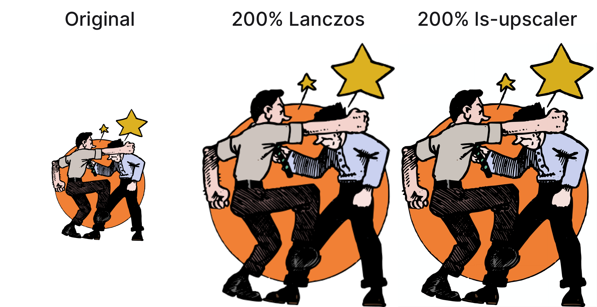
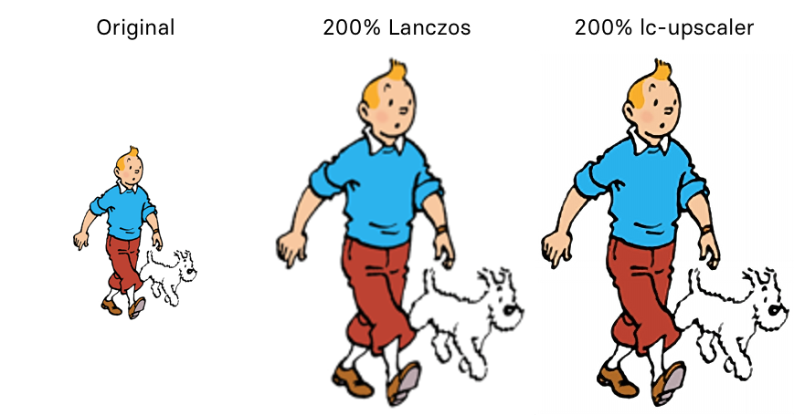

# lc-upscaler




lc-upscaler an upscaling model trained for the purpose of upscaling digital comics drawn in the style of *[ligne claire](https://en.wikipedia.org/wiki/Ligne_claire)*. It was trained on a custom dataset of pictures in that style. There is also an experimental denoiser that removes compression artifacts from the upscaled image. lc-upscaler was trained for a very specific use case (making digital comics look better screens with a high pixel density), which is why it's not a good choice for a general-purpose comic upscaler (for that, see [waifu2x](https://github.com/nagadomi/waifu2x)). It works best with clean lines and simple colors (i.e. no gradients or textures).

The upscaling model is based on the [ESPCN architecture by Shi et al](https://arxiv.org/abs/1609.05158). The denoiser is based on the [U-Net architecture by Ronneberger et al](https://arxiv.org/abs/1505.04597).

See the notebooks in the `notebooks` directory for a starting point on how to train your own upscaler or denoiser.

## Installation

Create a new Conda environment with the required dependencies:

```bash
$ conda create --name comic-upscaler --file requirements.txt
````

### Activate the environment

```bash
$ conda activate comic-upscaler
```

If you do not want to create a Conda environment, you can install the following required packages manually (see version numbers in `requirements.txt`):
- `click`
- `opencv-python`
- `pillow`
- `numpy`
- `tensorflow`

## Usage

```bash
$ python comic-upscaler <OPTIONS> image.jpg
```

With no additional options, the command above will output a 2 × upscaled PNG image named `image_upscaled.png`.

The following options are available:

* `--scale FLOAT`: The scale factor to use when upscaling the image. Valid range is `1.0-2.0`. Default value is `2.0`, i.e. 2 × upscaling.
* `--compress`: Compress the output using JPEG compression. If not specified, the output will be saved as a PNG image.
* `--quality INT`: The quality of the JPEG compression. Valid range is `1-100`. Default value is 90. `--compress` must be specified for this option to have any effect.
* `--denoise`: Apply a denoising filter to the input image. This is an experimental feature and may not work well with all images.
* `--suffix STRING`: The suffix to use for the output filename. Default value is `"_upscaled"`, i.e. `image.png` will be saved as `image_upscaled.png`.

> **NOTE:** The upscaling process may take a while, depending on the size of the input image. As an example, a 1500×2000 page takes about 15 seconds to upscale on my machine. If denoising is enabled, the process will take even longer. The same 1500×2000 page takes about 45 seconds to upscale with denoising enabled. Denoising is not always required, in fact, sometimes it may worsen the output quality.
